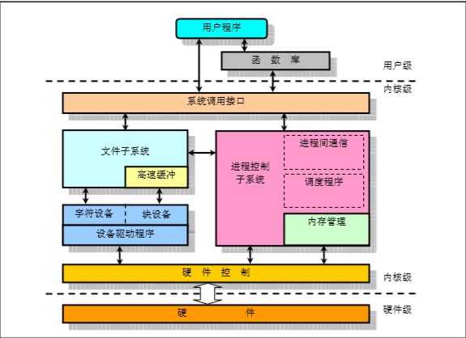

# 第二章  Linux内核体系结构

### Linux内核模式和体系机构

#### 整体式的单内核模式


在单内核模式系统中，操作系统提供服务的流程为：应用主程序使用指定的参数执行系统调用命令，使CPU从用户态（User Mode）切换到核心态（Kernel Mode），然后系统根据参数值调用特定的系统调用服务程序，而这些服务程序则根据需要调用底层的支持函数以完成特定的功能。在完成了应用程序要求的服务后，操作系统又从核心态切换回用户态，回到应用程序中继续执行后续命令。

#### 体系结构

Linux 内核主要由5个模块构成，分别是：进程调度模块，内存管理模块，文件系统模块，进程间通信模块，网络接口模块




### Linux中断机制

中断芯片获得中断请求-->根据优先级将中断号送到CPU-->CPU获得相应的中断向量，执行中断服务程序。

对于Linux内核来说，中断分为硬件中断和软件中断（异常）

### Linux系统定时

#### 时钟中断

Linux的OS时钟的物理产生原因是可编程定时/计数器产生的输出脉冲，这个脉冲送入CPU，就可以引发一个中断请求信号，我们就把它叫做时钟中断。

“时钟中断”是特别重要的一个中断，因为整个操作系统的活动都受到它的激励。系统利用时钟中断维持系统时间、促使环境的切换，以保证所有进程共享CPU。

利用时钟中断进行记帐、监督系统工作以及确定未来的调度优先级等工作。可以说，“时钟中断”是整个操作系统的脉搏。

#### 系统定时

在 Linux 0.11 内核中, PC 机的可编程定时芯片 Intel 8253 被设置成每隔 10 毫秒就发出一个时钟中断( IRQ0 )信号。这个时间节拍就是系统运行的脉搏,我们称之为 1 个系统滴答因此每经过 1 个滴答就会调用一次时钟中断处理程序(timer_interrupt )。该处理程序主要用来通过 jiffies 变量来累计自系统启动以来经过的时钟滴答数。每当发生一次时钟中断该值就增 1 。然后从被中断程序的段选择符中取得当前特权级 CPL 作为参数调用 do_timer() 函数。

do_timer() 函数则根据特权级对当前进程运行时间作累计。如果 CPL=0 ,则表示进程是运行在内核态时被中断,因此把进程的内核运行时间统计值 stime 增 1 ,否则把进程用户态运行时间统计值增 1 。如果程序添加过定时器,则对定时器链表进行处理。若某个定时器时间到(递减后等于 0 ),则调用该定时器的处理函数。然后对当前进程运行时间进行处理,把当前进程运行时间片减 1 。如果此时进程时间片已经递减为 0 ,表示该进程已经用完了此次使用 CPU 的时间片,于是程序就会根据被中断程序的级别来确定进一步处理的方法。若被中断的当前进程是工作在用户态的(特权级别大于 0 ),则 do_timer() 就会调用调度程序 schedule() 切换到其它进程去运行。如果被中断的当前进程工作在内核态,也即在内核程序中运行时被中断,则 do_timer() 会立刻退出。

因此这样的处理方式决定了 Linux 系统在内核态运行时不会被调度程序切换。**内核态程序是不可抢占**的,但当处于**用户态程序中运行时则是可以被抢占**的。

### Linux 进程控制

对于 Linux 0.11 内核来讲,系统最多可有 64 个进程同时存在。除了第一个进程是“手工”建立以外,其余的都是进程使用系统调用 fork 创建的新进程,被创建的进程称为子进程( child process ),创建者,则称为父进程( parent process )。内核程序使用进程标识号( process ID , pid )来标识每个进程。进程由可执行的指令代码、数据和堆栈区组成。进程中的代码和数据部分分别对应一个执行文件中的代码段、数据段。每个进程只能执行自己的代码和访问自己的数据及堆区。进程之间相互之间的通信需要通过系统调用来进行。对于只有一个 CPU 的系统,在某一时刻只能有一个进程正在运行。内核通过调度程序分时调度各个进程运行。
Linux 系统中,一个进程可以在内核态( kernel mode )或用户态( user mode )下执行,因此, Linux内核堆栈和用户堆栈是分开的。**用户堆栈**用于进程在用户态下临时保存调用函数的参数、局部变量等数据。**内核堆栈**则含有内核程序执行函数调用时的信息。

#### 进程控制块（PCB）

内核程序通过进程表对进程进行管理，，每个进程在进程表中占有一项，在Linux系统中，进程表项是一个`task_struct`的PCB指针，定义在头文件`sched.h`中，其中保存了用于控制和管理内存的所有信息。包括进程当前运行的状态信息，信号，进程号，父进程号，运行时间累计值，正在使用的文件和本任务的局部描述符以及任务状态段信息。

```c
struct task_struct {
/* these are hardcoded - don't touch */
	long state;	
    /* -1 unrunnable, 0 runnable, >0 stopped */
	long counter;
    // 任务运行时间计数(递减)(滴答数),运行时间片。
	long priority;
    // 运行优先数。任务开始运行counter=priority,越大运行越长。
	long signal;
    // 信号。是位图,每个比特位代表一种信号,信号值=位偏移值+1。
	struct sigaction sigaction[32];
    // 信号执行属性结构，对应信号将要执行的操作和标志信息
	long blocked;
    /* bitmap of masked signals */
    //进程信号屏蔽码（对应信号位图）
    /* various fields */
	int exit_code;
    // 任务执行停止的退出码,其父进程会取。
	unsigned long start_code,end_code,end_data,brk,start_stack;
    /*
      start_code 代码段地址
      end_code 代码长度（字节数）
      end_data 代码长度+数据长度（字节数）
      brk 总长度（字节数）
      start_stack 堆栈段地址
    */
	long pid,father,pgrp,session,leader;
    /*
      pid 进程标识号（进程号）
      father 父进程号
      pgrp 父进程组号
      session 会话号
      leader 会话首领
    */
	unsigned short uid,euid,suid;
	unsigned short gid,egid,sgid;
    /*
      uid 用户id
      euid 有效用户id
      suid 保存的用户id
      gid 组id
      egid 有效组id
      sgid 保存的组id
    */
	long alarm;
    //报警定时值（滴答数）
	long utime,stime,cutime,cstime,start_time;
    /*
      utime 用户态运行时间
      stime 系统态运行时间
      cutime 子进程用户态运行时间
      cstime 子进程系统态运行时间
      start_time 进程开始时刻
    */
	unsigned short used_math;
    //标志，是否使用了协处理器
/* file system info */
	int tty;		/* -1 if no tty, so it must be signed */
    // 进程使用 tty 的子设备号。-1 表示没有使用。
	unsigned short umask;
    // 文件创建属性屏蔽位。
	struct m_inode * pwd;
    // 当前工作目录 i 节点结构。
	struct m_inode * root;
    // 根目录 i 节点结构。
	struct m_inode * executable;
    // 执行文件 i 节点结构。
	unsigned long close_on_exec;
    // 执行时关闭文件句柄位图标志。(参见 include/fcntl.h)
	struct file * filp[NR_OPEN];
    // 文件结构指针表,最多 32 项。表项号即是文件描述符的值。
	struct desc_struct ldt[3];
    /* ldt for this task 0 - zero 1 - cs 2 - ds&ss */
    // 任务局部描述符表。0-空,1-代码段 cs,2-数据和堆栈段 ds&ss。
	struct tss_struct tss;
    /* tss for this task */
    // 进程的任务状态段信息结构。
};
```

当一个进程在执行时, CPU 的所有寄存器中的值、进程的状态以及堆栈中的内容被称为该进程的上下文。当内核需要切换( switch )至另一个进程时,它就需要保存当前进程的所有状态,也即保存当前进程的上下文,以便在再次执行该进程时,能够恢复到切换时的状态执行下去。在 Linux 中,当前进程上下文均保存在进程的PCB中。在发生中断时,内核就在被中断进程的上下文中,在内核态下执行中断服务例程。但同时会保留所有需要用到的资源,以便中断服务结束时能恢复被中断进程的执行。